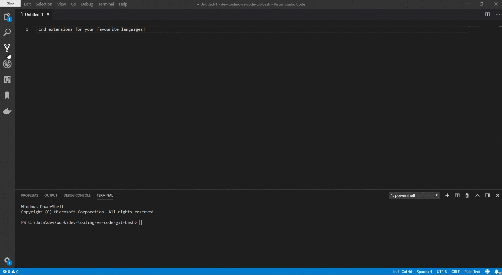

# <span style="color:orange">Dev Tooling - Introducing Visual Studio Code and Git Bash</span>

#### L&L - Youenn Bouglouan - January 2019

---
## <span style="color:orange">Visual Studio Code</span>

Available for free at <b>https://code.visualstudio.com/</b>

Amongst others:
- text editor on steroids
- advanced IDE functionalities like Intellisense, debugging, code navigation
- lightweight
- cross-platform (Windows / Linux / Mac)
- integrated console / terminal
- built-in git support
- built-in markdown support
- built-in file comparison / diff tool

### <span style="color:orange">Languages supported</span>

Language extensions are available for all major programming languages. They include support for:
- syntax highlighting
- linting
- debugging
- code completion
- code navigation
- code snippets
- refactoring



Languages extensions that I've used so far:
<em>C#, F#, Elm, Elixir, Kotlin, Go, Rust, JavaScript</em>

### <span style="color:orange">Useful extensions</span>

1. <b>GitLens</b> - add advanced git support directly from your files
2. <b>REST Client</b> - send HTTP requests and display responses from VS Code
3. <b>Excel Viewer</b> - preview Excel and CSV files from VS Code
4. <b>Bookmarks</b> - create bookmarks in your files and quickly jump between them
5. <b>vscode-icons</b> - nice set of icons for the file explorer
6. <b>MySQL</b> - run MySQL queries from within VS Code
7. <b>SQL Server (mssql)</b> - run SQL Server queries from within VS Code

### <span style="color:orange">Useful shortcuts</span>

<b><cite>CTRL+SHIFT+P - One shortcut to rule them all!</cite></b>

- <b>CTRL+P</b>: go to file
- <b>CTRL+T</b>: go to member (class, function, property...)
- <b>CTRL+SHIFT+F</b>: search text in all files
- <b>CTRL+B</b>: toggle side bar visibility
- <b>CTRL+ALT+F</b>: format document

### <span style="color:orange">Tips and tricks</span>

1. Quick renaming with <b>CTRL+D</b>

2. Hide folders that you don't need

    - create a `.vscode` folder
    - create a `settings.json` file with the following content
    ```json
    {
        "files.exclude": {
            "**/bin": true,
            "**/obj": true
        }
    }
    ```

3. Maximize Editor Group

    - press <b>CTRL+SHIFT+P</b>
    - type `Maximize Editor Group`
    - the current editor window will maximize automatically

4. Disable extensions per workspace


### <span style="color:orange">Code, test, and debug a C# web service</span>

<b>live demo, baby!</b>

```json
// add this to launch.json to change the web service's port
"ASPNETCORE_URLS": "http://localhost:5555"
```

---
## <span style="color:orange">Git Bash</span>

1. Setup
2. Overall functioning
3. Why not another terminal / shell?
4. Aliases
5. Most useful Unix commands
6. Docker commands
7. Git commands
8. Scripting
9. Demo!
